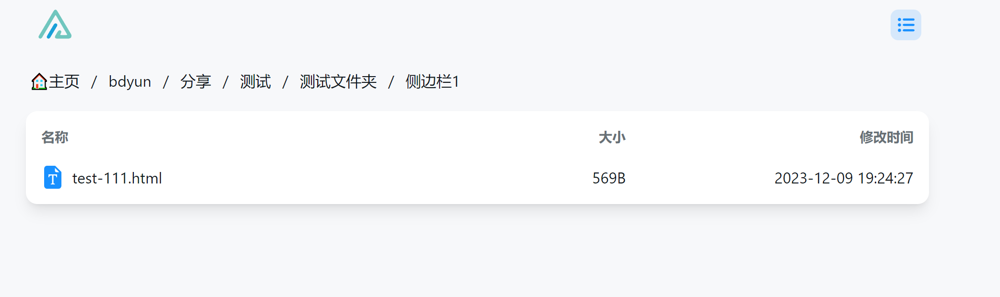
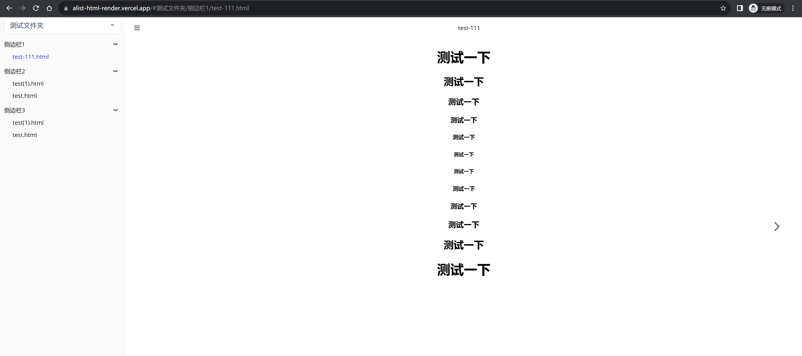
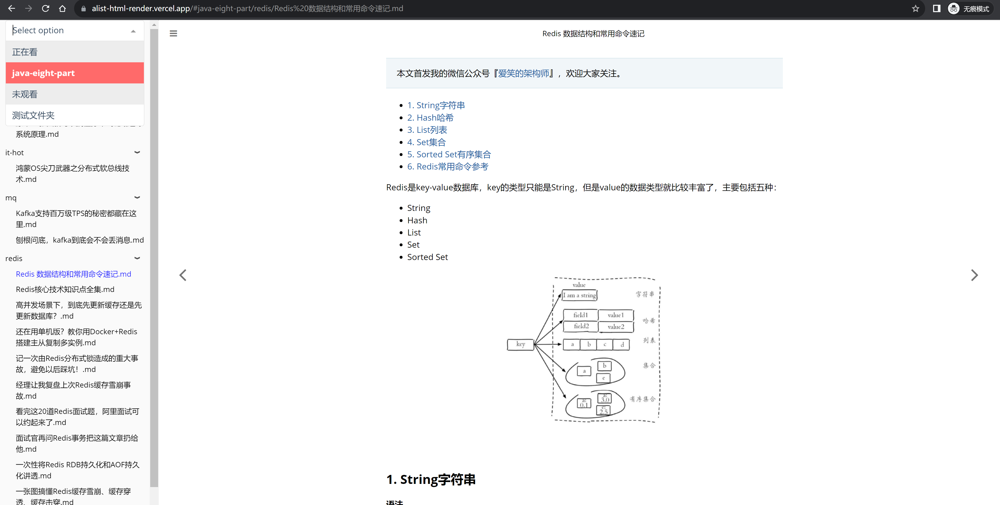

# 简介
html、md、pdf预览，自动生成目录，支持移动端。

实现了一个基于alist API的在线文档预览渲染器网站，
根据文件目录结构自动生成侧边栏，自动记住多目录观看进度，支持预览`md > html > pdf`，
支持`pwa`，markdown代码高亮，
前端样式参考[mdbook](https://github.com/rust-lang/mdBook)实现
# 更新记录
**2024-02-23**：支持按照SUMMARY.md对左侧菜单排序
# 配置
进入网页需要在弹出框输入alist相关配置

专栏位置：专栏在alist的路径 如全路径为`http://192.168.123.8:5244/bdyun/html合集`，则**专栏位置为：/bdyun/html合集**,
alist地址为**http://192.168.123.8:5244**

alistToken：alist的token 从路径`/@manage/settings/other`中的令牌获取

请求中如出现跨域问题，请开启alist的本地代理功能

# 效果

markdown来源: [java-eight-part](https://github.com/CoderLeixiaoshuai/java-eight-part)

